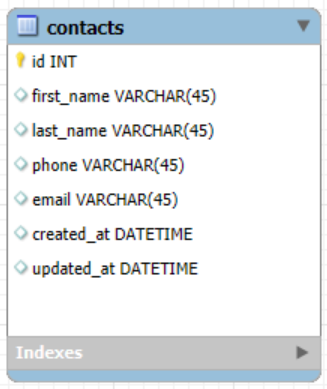

# Activity 1

- Author:  Cody Crosby
- Date:  26 October 2025

---

## Introduction

- The Phonebook application is a simple web app built to test deployment to different cloud platforms. It stores user-inputted contact information, allowing basic operations like adding, editing, viewing, and deleting contacts. It was developed using Spring Boot, Bootstrap, and SLF4J, following N-layer architecture with separation between the UI, service, and data layers.

---

## Resources

 - [Screencast](https://www.loom.com/share/7efca107b88c409f82cd302dd462ec3f) demonstrating the current state and function of the test application
 
 - [API Documentation](https://documenter.getpostman.com/view/43669754/2sB3WjzjEo) - generated by Postman

---

## Azure

- Azure Portal 
  
    - Screenshot confirming active Azure for Students subscription

---

## Framework and Technology

 - This project was built using Spring Boot for the backend and MySQL as the database. The front end is developed with Thymeleaf templates and styled using Bootstrap to create a responsive interface. Logging is handled through SLF4J with Logback for tracking application activity and identifying potential issues. These technologies were selected as part of the BSSD program requirements.

---

## Database Design

 - Contacts Table
    
   
     
     - The database for the test application consists of a single table, Contacts, which stores all user-entered contact information such as names, phone numbers, and email addresses

---

## Application progress

 - The test application is fully functional and meets all outlined requirements. It follows a standard N-Layer architecture with separate model, repository, service, and controller components. The ContactController manages user-facing pages, while the ContactApiController handles REST API operations.
 
### Completed Pages and Services

 - **Home Page**: Provides navigation for the site and displays brief description of the app
 
 - **Create/Edit Contact Page**: Reusable page allows users to create new contacts or update existing records
 
 - **Contact List**: Displays all saved contacts as Bootstrap cards with edit and delete options
 
 - **Delete Function**: Implemented through buttons on the contact cards

---

## Remaining Tasks and Current Issues

 - There are currently no major issues blocking development. The application runs smoothly and all CRUD operations function correctly. Some small improvements to form validation and error messages could enhance the application. The next step will be deploying the app to a cloud platform.

---

## Cloud Computing Research

 - Cloud computing went from the concept of distributed computing and virtualization in the 1960s, to large-scale, on-demand services. Companies like Amazon and Google began offering cloud platforms in the early 2000's that gave businesses the ability to rent computing power instead of purchasing and maintaining their own servers. Over time, cloud services expanded to include models like IaaS, PaaS, and SaaS, as well as serverless computing, giving developers the ability to deploy and scale applications without needing to manage the underlying infrastructure.

---

## Conclusion

- This project covered the design, development, and preparation of a Spring Boot web application for cloud deployment. It integrates MySQL with a Java backend, creates a responsive interface with Bootstrap and Thymeleaf, and implement logging for monitoring and debugging. The Phonebook app will serve as a test case for cloud deployment in future activities.