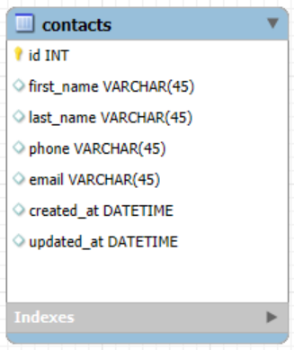

# Activity 2

- Author:  Cody Crosby
- Date:  2 November 2025

---

## Introduction

- The Phonebook application is a simple web app built to test deployment to different cloud platforms. It stores user-inputted contact information, allowing basic operations like adding, editing, viewing, and deleting contacts. It was developed using Spring Boot, Bootstrap, and SLF4J, following N-layer architecture with separation between the UI, service, and data layers.

---

## Resources

 - [Screencast](https://www.loom.com/share/2bc946085b6142d88ee0585ecd1a2932) demonstrating the current state and function of the test application
 
 - [API Documentation](https://documenter.getpostman.com/view/43669754/2sB3WjzjEo) - generated by Postman

---

## Framework and Technology

 - This project was built using Spring Boot for the backend and MySQL as the database. The front end is developed with Thymeleaf templates and styled using Bootstrap to create a responsive interface. Logging is handled through SLF4J with Logback for tracking application activity and identifying potential issues. These technologies were selected as part of the BSSD program requirements.

---

## Database Design

 - Contacts Table
    
   
     
     - The database for the test application consists of a single table, Contacts, which stores all user-entered contact information such as names, phone numbers, and email addresses

---

## Application Progress

 - The test application is fully functional and meets all outlined requirements. It follows a standard N-Layer architecture with separate model, repository, service, and controller components. The ContactController manages user-facing pages, while the ContactApiController handles REST API operations.
 
### Completed Pages and Services

 - **Home Page**: Provides navigation for the site and displays brief description of the app
 
 - **Create/Edit Contact Page**: Reusable page allows users to create new contacts or update existing records
 
 - **Contact List**: Displays all saved contacts as Bootstrap cards with edit and delete options
 
 - **Delete Function**: Implemented through buttons on the contact cards
 
 - **Input Validations**: All fields are checked for completeness and proper format

---

## Improvements

 - Input validation was added to ensure proper formatting for contact data, and a check was implemented to prevent duplicate emails from being added to the database.

---

## Cloud Computing Research

 - The main differences between Platform as a Service (PaaS) and Infrastructure as a Service (IaaS) comes down to speed, control, and responsibility. IaaS offers full control over the operating system, runtime, and configurations, making it best suited for custom environments but requires managing setup, scaling, and maintenance. PaaS provides a pre-configured environment with built-in tools and services that speed up development and reduce overhead. Developers using PaaS can focus more on writing code and deploying applications, while those on IaaS need to handle infrastructure tasks as well.

---

## Conclusion

- This activity finalized the Phonebook test application, confirming that it meets all the technical requirements for deployment testing in future topics. The project demonstrates a full-stack implementation with a database backend, clean user interface, and complete CRUD functionality.