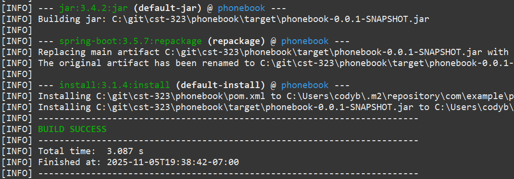
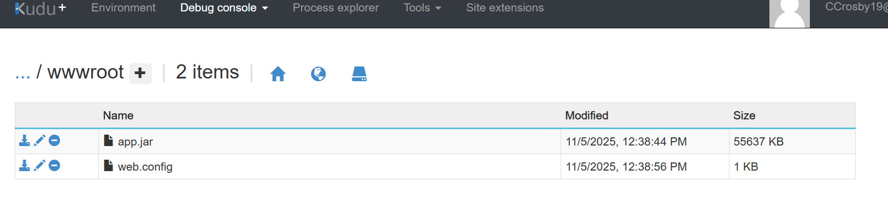
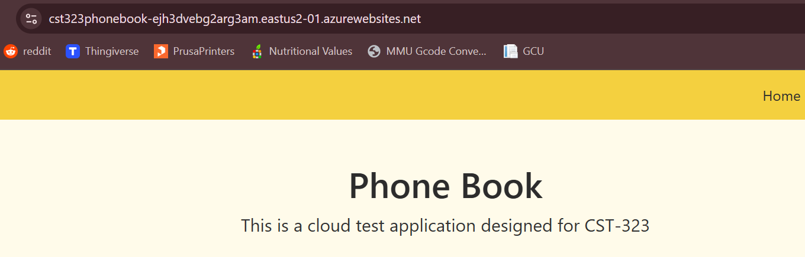

# Activity 3

- Author:  Cody Crosby
- Date:  9 November 2025

---

## Introduction

- This activity walks through the full process of deploying a Spring Boot web application to Microsoft Azure using a MySQL database backend. The steps included provisioning a flexible MySQL server, configuring database access and schema, updating the Spring Boot application’s connection properties, and deploying the packaged JAR file to an Azure Web App.
 
---

## Azure Deployment

 - [Screencast](https://www.loom.com/share/aa0e80a8c6574574a8bbb9b8187f82b8) demonstrating the application running on Azure
 
### 1. Provision the MySQL Database

 1. Log into the Azure Portal and search for **Azure Database for MySQL**
 
 2. Create a **Flexible Server** instance using Azure for Students subscription
 
 3. Configure the database:
    
    - Set database name, admin username, and password
 	
    - Leave defaults for region, version, and workload type
 	
    - Enable public access and add firewall rule `0.0.0.0 – 255.255.255.255`
 
 4. Confirm and create the database
 
 
 
  - Screenshot of the created Azure Database. I began the how-to before seeing the instruction to capture screenshots during the creation process
 
### 2. Initialize the Database Schema

 1. Navigate to **Databases** and find **+ Add** to create the schema
 
 2. Connect using MySQL Workbench and the provided connection details
 
 3. Execute the DDL script to create tables
 
 
 - No image was captured of this step. I began the how-to before seeing the instruction to capture screenshots during the creation process.
 
### 3. Configure the Spring Boot Application

 1. Update `application.properties` with Azure MySQL credentials:
 
 ```properties
spring.datasource.url=jdbc:mysql://cst323contacts.mysql.database.azure.com:3306/cst323activity
spring.datasource.username=cody
spring.datasource.password=Password1
spring.datasource.driver-class-name=com.mysql.cj.jdbc.Driver
 ```
 2. Ensure the Java version in pom.xml matches Azure runtime (Java 17)
 
 3. Build the application using Maven and rename the output to app.jar.
 
 
 
### 4. Deploy the Web Application in Azure

 1. Create a Web App: choose Java 17 + Tomcat 9, Windows OS, and code publish
 
 2. Use Advanced Tools (Kudu) to access site/wwwroot and remove existing files
 
 3. Upload app.jar and web.config to the root of wwwroot as zip file
 
  
 	
  - Screenshot of the created Azure application
  
  
  
  - Kudu console showing uploaded files
  
### 5. Verify Application

 1. Open the web app URL from Azure
 
 2. Confirm the home page loads with proper styling and dynamic navbar
 
 
 
 - Test application running in Azure
 
### Challenges Encountered
 
 1. Static Content Not Rendering
 
    - CSS and navbar initially did not appear. IIS/HTTPPlatformHandler was serving files incorrectly. 
     
 2. Server Port Issues
 
    - Using %HTTP_PLATFORM_PORT% in web.config caused a NumberFormatException
 
 3. web.config XML Formatting
 
    - Initial 500.19 error due to malformed XML. Corrected quotes and ensured <httpPlatform> syntax.
 
---

## Cloud Computing Research

### A.

### B.


 |Feature|Azure|OpenShift|
 |--|--|--|
 |Scalability| Highly scalable across global regions and availability zones. Comes with  built-in autoscaling for VMs and other services| Scalable for containerized workloads  using cluster autoscaling. Can depend on the infrastructure when self-hosted|
 |Deployment Flexibility | Supports VMs, containers, serverless, and hybrid environments| Portable across on-prem and multiple clouds. Intended for hybrid or multi-cloud container deployments|
 |Pricing Model| Pay-as-you-go, reserved instances, and spot pricing. More customization but with more complexity| Subscription-based (Red Hat support). Costs depend on if it’s managed or self-hosted|
 |Service Catalog| Very broad catalog, nearly every stack component can be sourced from Azure| More focused catalog built around DevOps and Kubernetes workloads. Integrates with other Red Hat tools|
 |Vendor Lock-in| Can have high vendor lock-in if using Azure-specific services| Lower lock-in since it’s Kubernetes-based and portable across clouds|
 |Community & Support| Large enterprise ecosystem, global Microsoft support, and huge user base. Lots of certifications and tutorials available| Open-source and enterprise community via Red Hat and CNCF. Reliable enterprise support but smaller user base|
 |Security| Built-in security tools (Defender for Cloud). Meets global standards like ISO and HIPAA| Role-based access control, compliance automation, and isolation for clusters|
 |Ecosystem| Integrates with Microsoft products (Office 365, Active Directory, Visual Studio) and vast API ecosystem| Integration with open-source DevOps tools and works well in many environments|
 |Monitoring| Comes with tools like Azure Monitor, Log Analytics, and Security Center for visibility across all services| Built-in monitoring via Prometheus and OpenShift Console gives visibility into container and cluster performance|
 |Ease of Use| Easier for teams familiar with Microsoft stack. Beginner-friendly GUI portal| Can be a steeper learning curve for those new to Kubernetes|


--- 

## Conclusion

- The test application was successfully deployed to Microsoft Azure, along with it's MySQL database. Setup required troubleshooting of issues such as static resource rendering, port configuration, an Azure region exclusions. The Heroku portion of the assignment was unable to be completed due to the service not allowing creation of a new account. Key takeways include:

		- Configuring database credentials and web.config files
	
		- Creating and deploying web apps on PaaS environments
	
		- Importance of proper syntax in environment and configuration files
