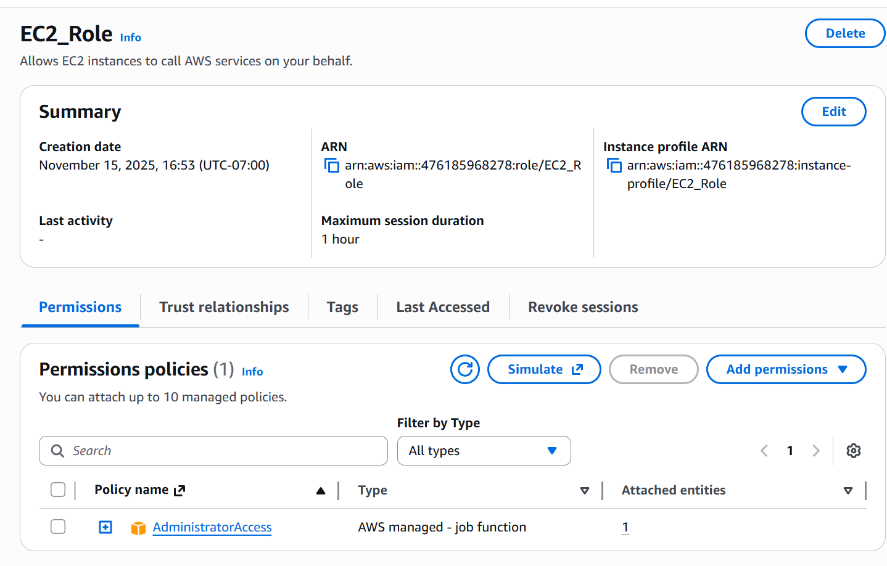
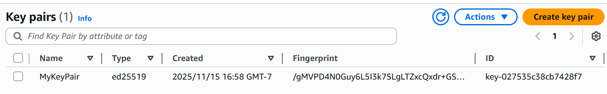
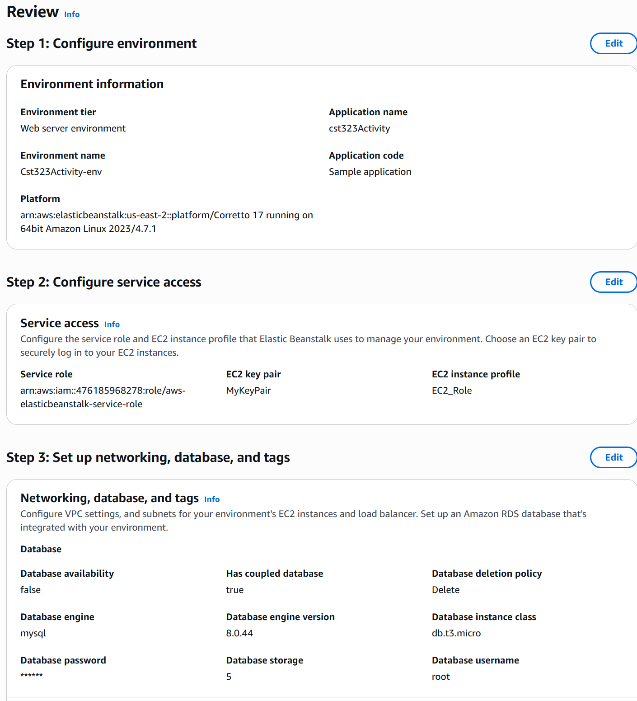
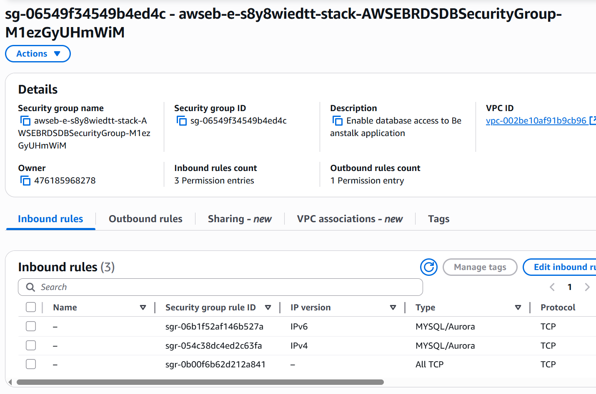
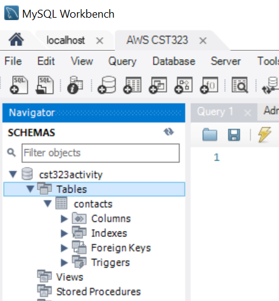
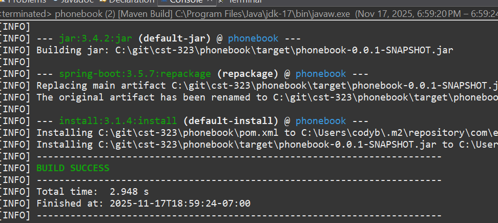
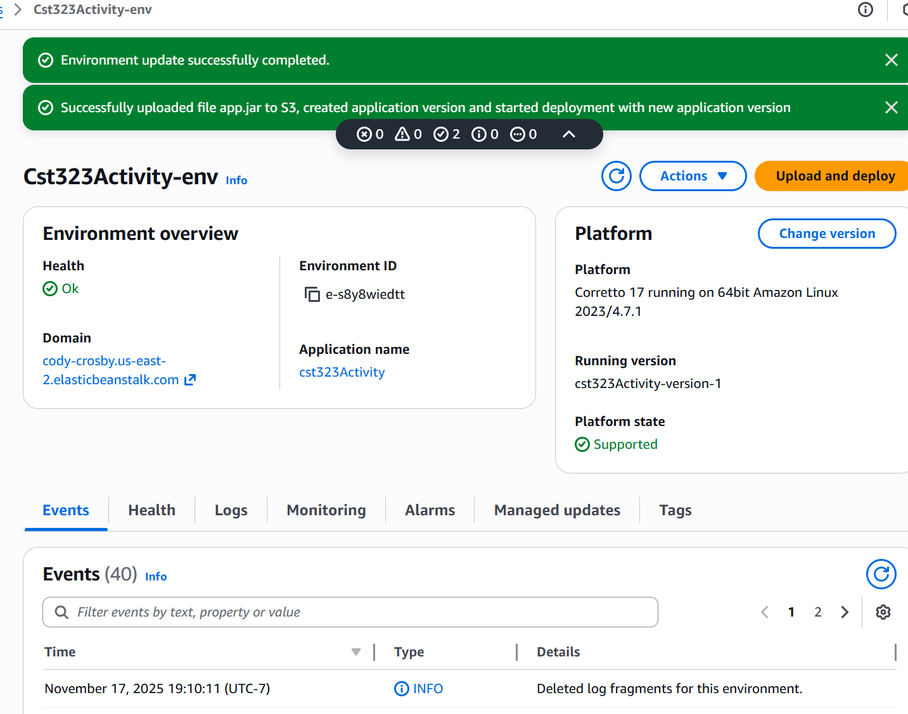
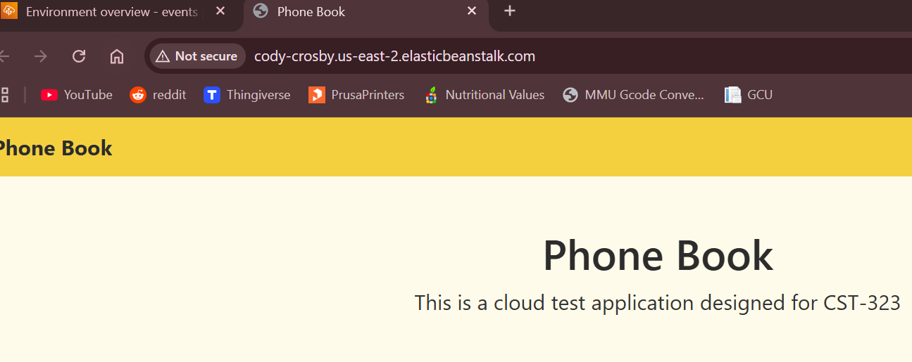

# Activity 4

- Author:  Cody Crosby
- Date:  23 November 2025

---

## Introduction

- This activity will
 
---

## AWS Deployment

 - [Screencast](https://www.loom.com/share/36e4696f4e004fafa8b66e035e8d8fa8) demonstrating the application running on AWS Elastic Beanstalk
 
### 1. Create IAM Role for EC2

 1. In the AWS Management Console, search for IAM Roles and create a new role
 
 2. Choose AWS Service - EC2 as the trusted entity type
 
 3. Name the role EC2_Role and create it
     
 
 
 - Details page of created Role 
 
### 2. Create an EC2 Key Pair

 1. Search for Key Pairs in the AWS console and create a new key pair named MyKeyPair
 
 2. Use: 
 	
    - ED25519 as the key type
 	
 	- .ppk as the file format
 
 3. Download and save the key
 
 
 
  	- Newly created Key Pair 
 
### 3. Create the Elastic Beanstalk Application Environment

 1. Open Elastic Beanstalk and create a new application named cst323Activity

 2. Create a Web Server Environment and configure:
 
 	- Environment domain: cody-crosby
 	
 	- Platform: Java (Corretto 17 / Amazon Linux 2023)
 	
 	- Application code: Sample application
 
 3. Configure service access:
 
    - Create a new service role when prompted
 	
 	- Choose MyKeyPair as the EC2 key pair
 	
 	- Select EC2_Role (created earlier) for the instance profile
 	
 4. Enable the integrated database and configure:
 
    - Engine: MySQL 8.0.44
 	
    - Instance class: db.t3.micro
 	
    - Set admin username and password
 	
    - Set deletion policy to Delete
 	
 5. Submit the environment creation and wait for AWS to provision
 
 
 
    - Review of settings used to create Beanstalk instance
 
### 4. Configure the AWS RDS Database

 1. Open the RDS service and locate the generated MySQL instance.
 
 2. Under Connectivity & Security:
 
    - Public Accessibility = Yes
    
    - Copy the Endpoint and Port
 
 3. Update inbound rules on the linked security group:
 	
 	- Add MySQL/Aurora rule for Anywhere-IPv4
 	
 	- Add MySQL/Aurora rule for Anywhere-IPv6
 	
 
 
    - inbound rules set for AWS RDS
  
 4. Connect to the RDS MySQL instance using MySQL Workbench and the endpoint, username, and password from the RDS settings
 
 5. Run DDL script to create all required tables

  
  
  	- DDL script imported to AWS RDS through MySQLWorkbench
  
### 5. Configure Spring Boot App & Deploy to AWS

 1. Update application.properties with AWS RDS values:
 
 ```properties
 spring.application.name=phonebook
 server.port=${PORT:8080}
 spring.datasource.url=jdbc:mysql://awseb-e-s8y8wiedtt-stack-awsebrdsdatabase-mqsvzd4vjwke.cjqiikyqcnha.us-east-2.rds.amazonaws.com:3306/cst323activity
 spring.datasource.username=root
 spring.datasource.password=password
 spring.datasource.driver-class-name=com.mysql.cj.jdbc.Driver
 ```
 
 2. Run a clean Maven build targeting Java 17

  
  
    - Console output of successful Maven build
  	
 3. In the Elastic Beanstalk environment, go to Configuration → Updates, Monitoring, and Logging and select Edit
 
 4. Update PORT environment variable to 8080
 
 5. Apply changes and wait for AWS to redeploy the environment
 
 6. Go to the environment and click Upload and Deploy
 
 7. Upload the JAR file generated during Maven build
 
 8. Deploy and wait for the health indicator to return to OK
  	 
 
 	
 	- JAR file uploaded to AWS and Health reporting as 'OK' 
 	
 9. From the dashboard, click the environment URL to confirm application loads
 
 
 
 	- Test application successfully running on AWS
 
---

## Google Cloud Deployment

 - [Screencast](https) demonstrating the application running on Google Cloud
 
### 1. step1

 1. Log
 
 2. Create
 
 3. Configure
    
    - Set
 	
    - Leave
 	
    - Enable
 
 4. Confirm 
 
 
 
  - Screenshot of 
 
### 2. step2

 1. Navigate
 
 2. Connect
 
 3. Execute
 
 
### 3. step3

 1. Update

 2. Ensure
 
 3. Build
 
 
 
### 4. step4

 1. Create
 
   
       
       - Screenshot of
 
 2. Use
 
 3. Upload
  
  
  
  - texthere
  
### 5. step5

 1. Open
 
 2. Confirm
 
 
 	
 	- Test 
 
---

### Challenges Encountered
 
 1. Static
 
    - CSS
     
 2. Server
 
    - Using
 
 3. web
 
    - Initial
 
---

## Cloud Computing Research

### A. REST API

 1. Migrating
    - Beginning 

 2. Ignoring
    - Forgetting
 	
 3. Failure
    - Moving
 	
 4. Neglecting 
    - Overlooking
 	
 5. Poor
    - Failing
 	
### B. AWS vs Google Cloud


 |Feature|AWS|Google Cloud|
 |--|--|--|
 |||
 |||
 |||
 |||
 |||
 |||
 |||
 |||
 |||
 |||

### C. Cloud Limitations

--- 

## Conclusion

 - The test application was successfully deployed to Microsoft Azure, along with it's MySQL database. Setup required troubleshooting of issues such as static resource rendering, port configuration, an Azure region exclusions.