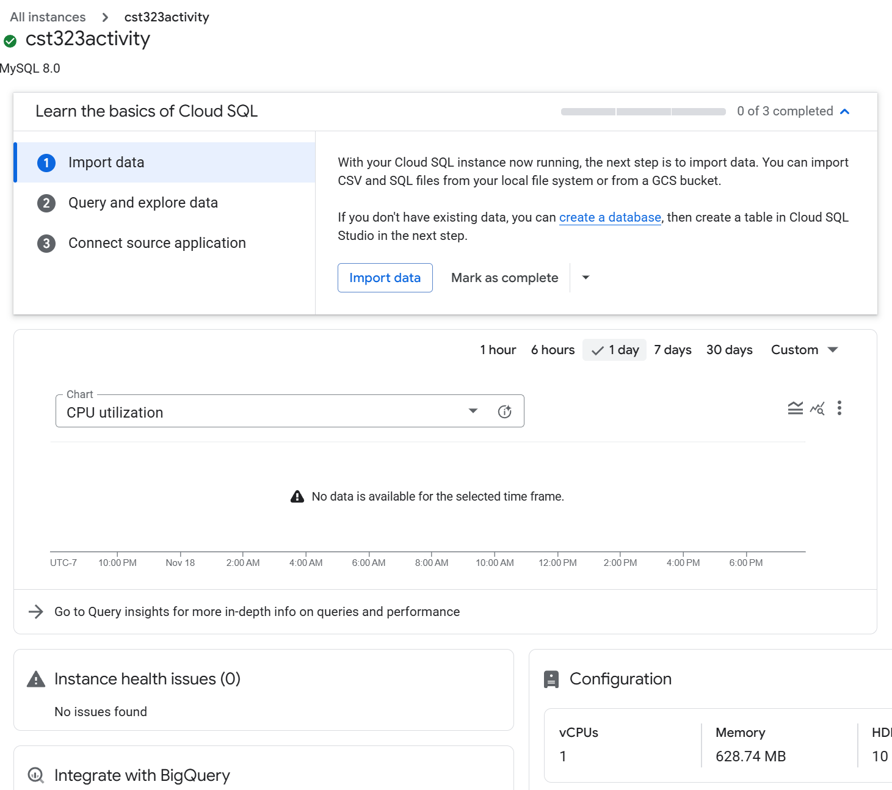
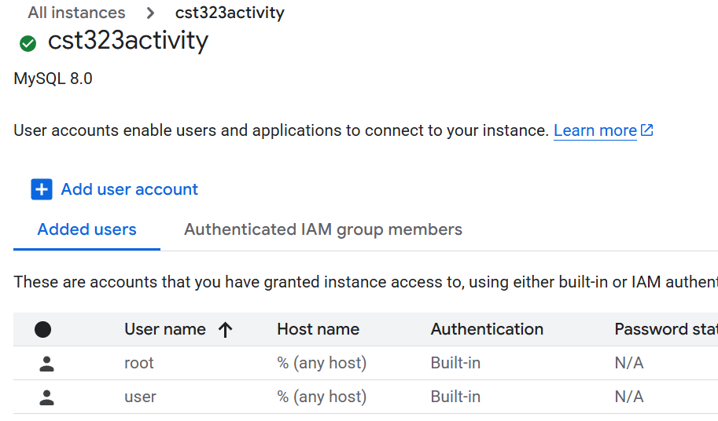
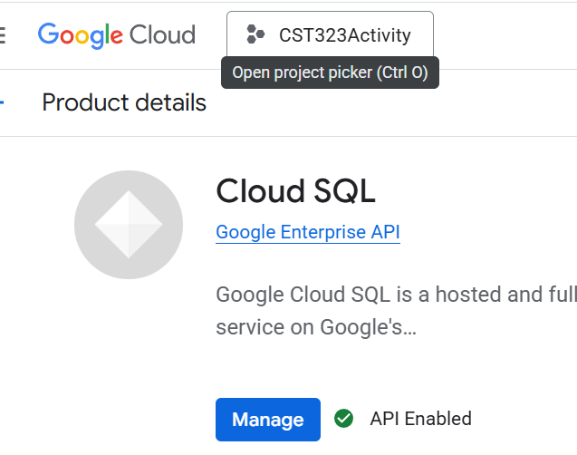
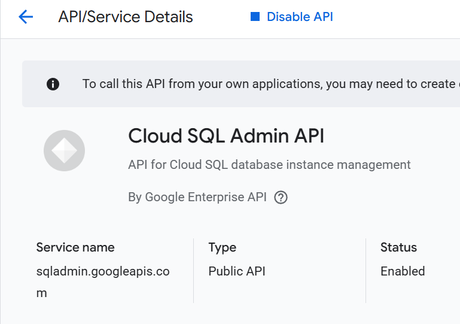
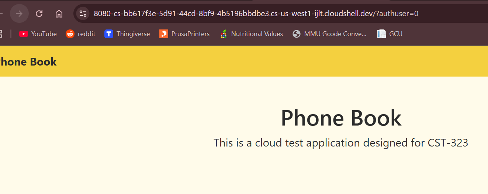
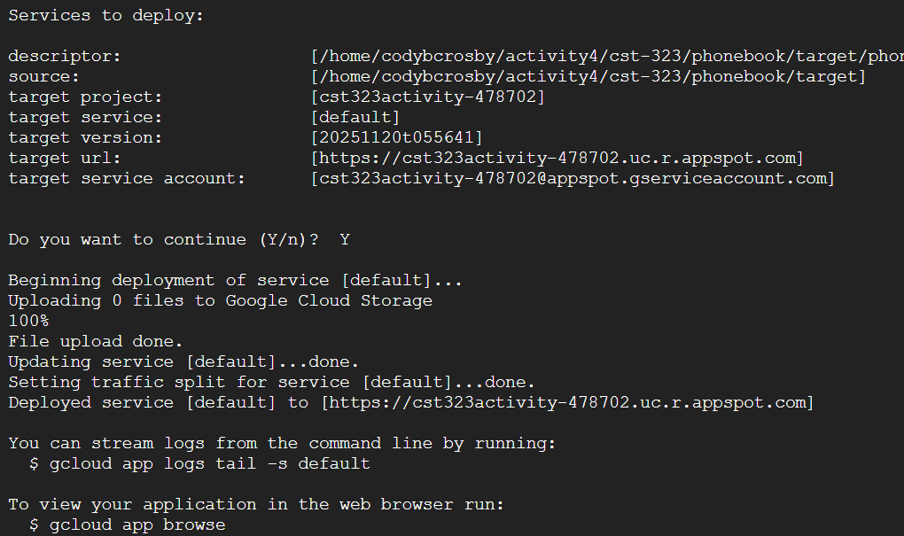
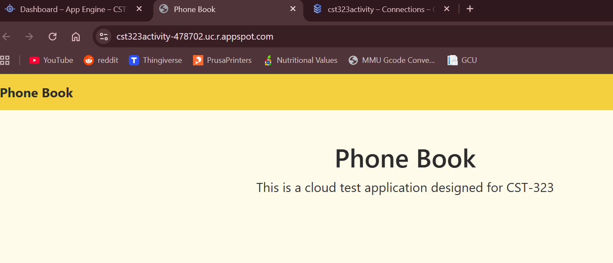

# Activity 4

- Author:  Cody Crosby
- Date:  23 November 2025

---

## Introduction

- This activity will
 
---

## AWS Deployment

 - [Screencast](https://www.loom.com/share/36e4696f4e004fafa8b66e035e8d8fa8) demonstrating the application running on AWS Elastic Beanstalk
 
### 1. Create IAM Role & EC2 Key Pair

 1. In the AWS Management Console, search for IAM Roles and create a new role
 
 2. Choose AWS Service - EC2 as the trusted entity type
 
 3. Name the role EC2_Role and create it
     
 
 
 - Details page of created Role 
 
 4. Search for Key Pairs in the AWS console and select Key Pairs
 
 5. Create a new key pair using: 
 
 	- Name: MyKeyPair
 	
    - Key type: ED25519
 	
 	- File format: .ppk
 
 6. Download and save the key
 
 
 
 - Newly created Key Pair 
 
### 3. Create the Elastic Beanstalk Application Environment

 1. Open Elastic Beanstalk and create a new application named cst323Activity

 2. Create a Web Server Environment and configure:
 
 	- Environment domain: cody-crosby
 	
 	- Platform: Java (Corretto 17 / Amazon Linux 2023)
 	
 	- Application code: Sample application
 
 3. Configure service access:
 
    - Create a new service role when prompted
 	
 	- Choose MyKeyPair as the EC2 key pair
 	
 	- Select EC2_Role (created earlier) for the instance profile
 	
 4. Enable the integrated database and configure:
 
    - Engine: MySQL 8.0.44
 	
    - Instance class: db.t3.micro
 	
    - Set admin username and password
 	
    - Set deletion policy to Delete
 
 
 
 - Review of settings used to create Beanstalk instance
 
 5. Submit the environment creation and wait for AWS to provision
 
### 4. Configure the AWS RDS Database

 1. Open the RDS service and locate the generated MySQL instance
 
 2. Under Connectivity & Security:
 
    - Public Accessibility: Yes
    
    - Copy the Endpoint and Port
 
 3. Update inbound rules on the linked security group:
 	
 	- Add MySQL/Aurora rule for Anywhere-IPv4
 	
 	- Add MySQL/Aurora rule for Anywhere-IPv6
 	
 
 
 - Inbound rules set for AWS RDS
  
 4. Connect to the RDS MySQL instance using MySQL Workbench and the endpoint, username, and password from the RDS settings
 
 5. Run DDL script to create required table

 
  
 - DDL script imported to AWS RDS through MySQLWorkbench
  
### 5. Configure Spring Boot App & Deploy to AWS

 1. Update application.properties with AWS RDS values:
 
 ```properties
 spring.application.name=phonebook
 server.port=${PORT:8080}
 spring.datasource.url=jdbc:mysql://awseb-e-s8y8wiedtt-stack-awsebrdsdatabase-mqsvzd4vjwke.cjqiikyqcnha.us-east-2.rds.amazonaws.com:3306/cst323activity
 spring.datasource.username=root
 spring.datasource.password=password
 spring.datasource.driver-class-name=com.mysql.cj.jdbc.Driver
 ```
 
 2. Run a clean Maven build targeting Java 17

 
 
 - Console output of successful Maven build
  	
 3. In the Elastic Beanstalk environment, go to Configuration, then under Updates, Monitoring, and Logging select Edit
 
 4. Update PORT environment variable to 8080
  
 5. Go to the environment and click Upload and Deploy
 
 6. Upload the JAR file generated during Maven build
 
 7. Deploy and wait for the health indicator to return to OK
  	 
 
 
 - JAR file uploaded to AWS and Health reporting as 'OK' 
 	
 8. From the dashboard, click the environment URL to confirm application loads
 
 
 
 - Test application successfully running on AWS
 
---

## Google Cloud Deployment

 - [Screencast](https://www.loom.com/share/0b265981884b4a489f759dc1df3ba752) demonstrating the application running on Google Cloud App Engine
 
### 1. Create Google Cloud Project & App Engine Application

 1. In the Google Cloud Console, click the Select a Project dropdown at the top
 
 2. Click the New Project icon
 
 3. Enter a project name (cst323activity) and click Create
 
 4. From the main menu, select App Engine then Services 
 
 5. On the “Welcome to App Engine” screen, click Create Application
 
 6. Choose a US region and set Java for Language and Flexible for Environment
 
### 2. Create Cloud SQL MySQL Database

 1. From the main menu, search SQL and choose Create Instance
 
 2. Choose MySQL, Enable API, and set Enterprise option to Sandbox
 
 3. Fill out:
 
 	- Instance ID

 	- Root password

 	- MySQL version: 8.0

 	- Region: US

 4. Expand Show Configuration Options:
 
 	- Machine configuration: Shared core, smallest CPU

 	- Storage: HDD, smallest capacity

 	- Connections: Enable Public IP

 	- Data Protection: Disable all except “Enable Data Protection”
 
 5. Click Create Instance and in the Connections panel, note the Public IP Address
 
 
  
 - New database added to Cloud SQL
 
 6. From the left pane, select Users, then Add User Account
 
 	- Username: user

 	- Host: Allow any host

 	- Click Add
	 
 
  
 - New database user added
  
 7. Select Databases and Create Database
 
 	- Name: cst323activity

 	- Click Create
 
 8. In Connections - Networking, under Authorized Networks, add IP address
 
 9. Connect to the database in MySQL Workbench using the IP, username, and password
 
 10. Run your DDL script to create required tables
 
 11. Go to APIs & Services then Library and enable Cloud SQL and Cloud SQL Admin API
 
 
  
 - Confirming Cloud SQL enabled on database
 
 
  
 - Confirming Cloud SQL Admin API enabled on database
 
### 3. Configure Spring Boot App

 1. Open Cloud Shell

 2. Create a working directory and clone repo:
 
 	- git clone https://github.com/ccrosby1/cst-323.git
 	
 	- cd cst-323/phonebook
 
 3. Open the editor and update the POM file:
 
 	- Set Java version to 17
 	
 	- Add Google Cloud dependencies
 	
 	- Add App Engine Maven plugin
 	
 4. Create a new directory src/main/appengine and file app.yaml:
 
 	- Set runtime variable to java17
 
 5. Update application.properties with Cloud SQL connection:
 
 ```properties
 spring.application.name=phonebook
 spring.datasource.url=jdbc:mysql://google/cst323activity?socketFactory=com.google.cloud.sql.mysql.SocketFactory&cloudSqlInstance=cst323activity-478702:us-central1:cst323activity
 spring.datasource.username=user
 spring.datasource.password=Password!1
 spring.datasource.driver-class-name=com.mysql.cj.jdbc.Driver
 ```
 
### 4. Test Locally in Cloud Shell

 1. Build the app:
 
    - mvn -DskipTests clean package
 
 2. Run the JAR:
 
 	- cd target
 	
 	- java -jar phonebook-0.0.1-SNAPSHOT.jar
 
 3. Click Web Preview, select Port 8080 to test locally
  
 
  
 - Testing application on local URL
  
### 5. Deploy to App Engine & Verify

 1. From the project root, run:
 
 	- gcloud app deploy target/phonebook-0.0.1-SNAPSHOT.jar
 
 2. Confirm deployment when prompted
 
 
  
 - Console output on successful deployment
 
 3. After deployment, return to App Engine / Dashboard and launch application
 
 
  
 - Application successfully hosted on Google Cloud 
 
---

### Challenges Encountered
 
 1. Local MySQL 8 Upgrade & Service Configuration Issues
 
    - Upgrading to MySQL 8 required manual configuration because the installer failed to properly register and start the service. Manually setting up the Windows service resolved the connection errors.
     
 2. First JAR Deployment Would Not Serve
 
    - The first JAR uploaded to Elastic Beanstalk only showed the default landing page instead of running the Spring Boot app. Rebuilding the project with a clean Maven build produced a working JAR.
 
 3. App Engine Deployment Hang at Staging Step
 
    - When deploying to GCP using the Maven plugin, the process repeatedly stalled after staging the application and detecting the app.yaml. Switching to the gcloud app deploy CLI command resolved the issue and allowed the deployment to complete successfully.
 
---

## Cloud Computing Research

### A. REST API

 1. Migrating
    - Beginning 

 2. Ignoring
    - Forgetting
 	
 3. Failure
    - Moving
 	
 4. Neglecting 
    - Overlooking
 	
 5. Poor
    - Failing
 	
### B. AWS vs GCP


 |Feature|AWS|GCP|
 |--|--|--|
 |Virtual Machines|EC2 instances are highly customizable for performance and pricing|VM customization through Compute Engine with option of per-second billing|
 |Serverless Computing|Run event-driven functions with AWS Lambda. Integrates with the rest of AWS services|Simple, scalable serverless deployment with Cloud Functions|
 |Object Storage|S3 buckets used for durable storage persisted across multiple zones|Object storage through Cloud Storage. Also with multi-zone persistence|
 |Block Storage|Block storage through EBS and EFS designed to work efficiently with EC2 instances|Persistent Disk and Filestore provided Compute Engine optimized storage|
 |Database|AWS RDS for various SQL databases and DynamoDB for NoSQL|Cloud SQL for managed SQL and Bigtable for NoSQL|
 |Networking|VPC and Elastic Load Balancer for secure networking|VPC and Cloud Load Balancing provide similar services|
 |IAM|Allows granular control over access through role-based permissions|Similar model with policies to dictate access and integration with google identities|
 |Monitoring|Detailed logging and metric from CloudWatch and CloudTrail|Simplified, and unified dashboard with data from Cloud Monitoring and Logging|
 |Pricing|Pay-as-you-go pricing with options for reserved instances and spot instances|Similar structure, but includes per-second billing and sustained use discounts|
 |Free Tier|6-months of limited free services with up to $200 in credit|$300 of free credits for the first 90 days|

### C. Cloud Limitations

--- 

## Conclusion

 - The test application was successfully deployed to Microsoft Azure, along with it's MySQL database. Setup required troubleshooting of issues such as static resource rendering, port configuration, an Azure region exclusions.