# Activity 5

- Author:  Cody Crosby
- Date:  30 November 2025

---

## Introduction

- This activity covers 
 
---

## Docker

### 1. Docker for Beginners – Linux 

 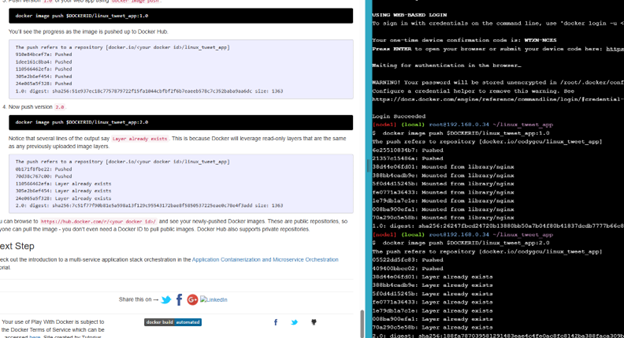
 
 - End of first tutorial, including instructions and terminal
 
 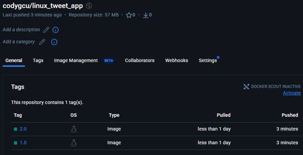
 
 - DockerHub page showing newly created images
 
### 2. Doing More With Docker Images 

 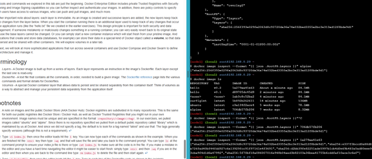
 
 - End of Second tutorial, including instructions and terminal
 
### 3. First Alpine Linux Containers

 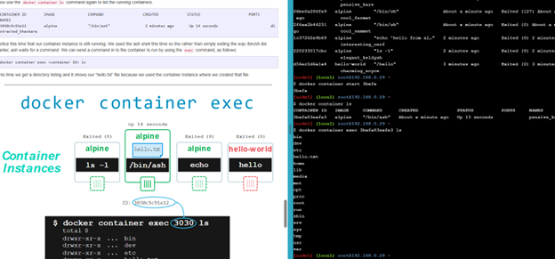
 
 - End of third tutorial, including instructions and terminal
  
### 4. Docker Images Deeper Dive

 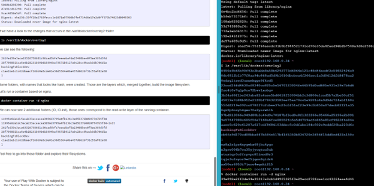
 
 - End of forth tutorial, including instructions and terminal
 
### 5. Docker Questions

 1. What is Docker?
 
 	- Docker is a platform that enables developers to build, package, and run applications in isolated environments called containers. It uses containerization technology to package an application with all its dependencies, libraries, and configuration files into a standardized unit that can run consistently across different computing environments.
 	
 2. What is a Docker File?
 
 	- A Dockerfile is a text document containing a series of instructions that Docker uses to automatically build an image. It's essentially a script of commands that users would run on the command line to assemble an image. Each instruction in a Dockerfile creates a layer in the image, allowing for efficient rebuilding and sharing of images.
 	
 3. What is a Docker Image?
 
 	- A Docker image is a lightweight, standalone, executable package that includes everything needed to run an application including code, runtime, system tools, libraries, and settings. Images are built from Dockerfiles and serve as templates for creating containers. They are immutable snapshots that can be versioned, shared, and stored in registries.
 	
 4. What is a Docker Container?
 
 	- A Docker container is a running instance of a Docker image. It's a standardized, encapsulated environment that runs applications isolated from the host system. Containers share the host operating system's kernel but have their own filesystem, processes, memory, and network interfaces. They can be started, stopped, moved, and deleted without affecting other containers or the host system.
 	
 5. What is Docker Hub? 
 
 	- Docker Hub is a cloud-based registry service that allows users to store, share, and manage Docker images. It serves as a repository where developers can publish their own images or download pre-built images created by others. Docker Hub offers both public repositories for open-source projects and private repositories for proprietary code.
 	
 6. What are five advantages to using Docker Containers? 
 
 	- Docker containers ensure consistency across environments, eliminating the "works on my machine" problem by packaging applications with all dependencies. This containerization approach provides isolation between applications while being more resource-efficient than traditional virtual machines. Docker enables rapid deployment with containers that start in seconds, facilitating easy horizontal scaling by quickly spinning up additional instances. The platform's approach to versioning application components encourages modular architecture and component reuse across projects. Finally, Docker simplifies dependency management by bundling all requirements with the application, preventing conflicts between different applications' dependencies and making deployment more reliable across diverse environments.

 7. What are five Docker commands you used in the tutorial and what was the purpose for using each of the commands? 
 
 	- docker image build -t hello:v0.1 .: Builds a Docker image from a Dockerfile in the current directory, tagging it with a name and version for easy reference.
 	
 	- docker container run hello:v0.1: Creates and starts a new container based on the specified image, executing the default command defined in the image.
 	
 	- docker image ls: Lists all Docker images stored locally on your system, showing their repository names, tags, IDs, creation times, and sizes.
 	
 	- docker container exec -it [container_id] [command]: Executes a command in a running container, with the -it flags providing an interactive terminal session.
 	
 	- docker image pull [image_name]: Downloads an image from a registry (like Docker Hub) to your local machine, making it available for creating containers.

---

## Kubernetes

### 1. What is Kubernetes in 3 minutes?

 - Kubernetes is an open-source container orchestration platform that automates the deployment, scaling, and management of containerized applications. It provides a declarative approach to infrastructure, where YAML files are used to define the desired state. The platform is self-healing by automatically replacing failed containers and rescheduling them when nodes die, implements load balancing to distribute network traffic as needed, and enables automated rollouts and rollbacks. Its configuration management separates application code from configuration, while resource optimization ensures efficient use of computing resources. Being highly extensible, Kubernetes allows you to add custom resources and controllers, and its open-source community continuously improves the platform with new features and security updates.
 
 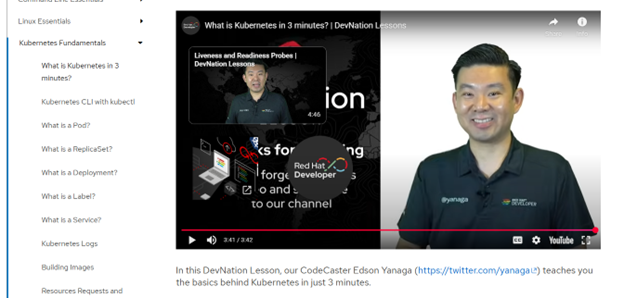
 
 - End of first tutorial video
 
### 2. Kubernetes CLI with kubectl

 - The kubectl command-line tool is the primary interface for interacting with Kubernetes clusters. This utility functions as a wrapper around the Kubernetes API, translating human-readable commands into API calls. Kubectl can be used to create namespaces for logical separation of resources and navigate between different contexts to manage multiple clusters or namespaces. The tool enables creating deployments from YAML files or directly from the command line, and allows dynamic scaling of deployments to match demand. Services can be established to expose applications internally or externally, while the describe command provides detailed information about any Kubernetes resource. kubectl also offers debugging capabilities through log access, port forwarding, and the ability to execute commands directly within containers.
 
 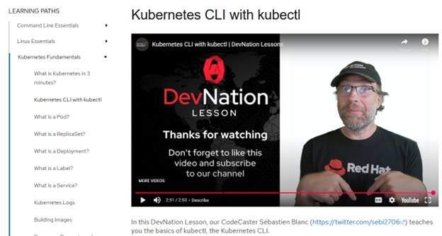
 
 - End of second tutorial video
 
### 3. What is a Pod?

 - A Pod represents the smallest deployable unit in Kubernetes and serves as the building block for all workloads. Each Pod encapsulates one or more containers that are always scheduled together on the same node and share the same network namespace, allowing containers within a Pod to communicate via localhost. These containers share the same lifecycle, storage volumes, and IP address. In kubectl commands, Pods can be referenced using the shorthand "po" or "pods". Pods are generally ephemeral by nature and are not designed to be created directly but rather managed through higher-level abstractions like Deployments. Each Pod receives its unique IP address within the cluster network and can define resource requests.
 
 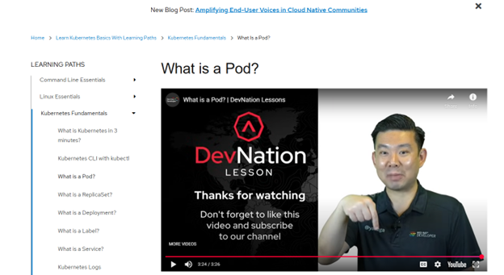
 
 - End of third tutorial video
 
### 4. What is a ReplicaSet?

 - A ReplicaSet is a Kubernetes controller that ensures a specified number of identical Pod replicas are running at all times. It serves as an abstraction layer that acquires and manages the necessary compute resources for containers, continuously monitoring the health of its Pods. If a Pod fails or is terminated, the ReplicaSet automatically creates replacement instances to maintain the desired count. ReplicaSets use label selectors to identify which Pods they are responsible for managing, allowing for flexible grouping of resources. ReplicaSets are typically generated and managed by Deployments, rather than directly by users. ReplicaSets support scaling operations to increase or decrease the number of running replicas based on demand or resource constraints.
 
 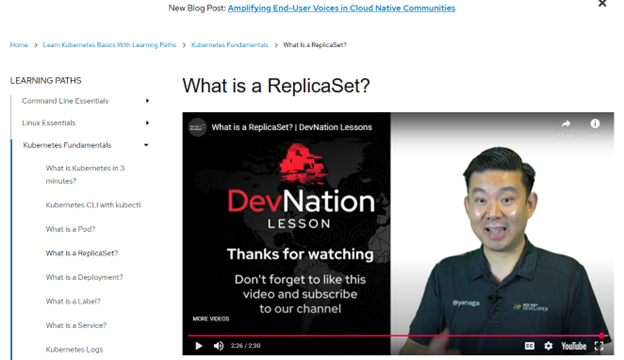
 
 - End of forth tutorial video
  
### 5. What is a Deployment?

 - A Deployment is a higher-level Kubernetes resource that manages ReplicaSets to provide declarative updates for Pods. It fulfills the declared state of applications by ensuring the actual state matches the desired configuration specified in YAML. Each Deployment creates and manages one or more ReplicaSets, automatically scaling them up or down during updates. Deployments maintain a complete history of configuration changes, enabling tracking of application evolution over time. This history feature allows for rollbacks to previous versions if an update introduces issues.
 
 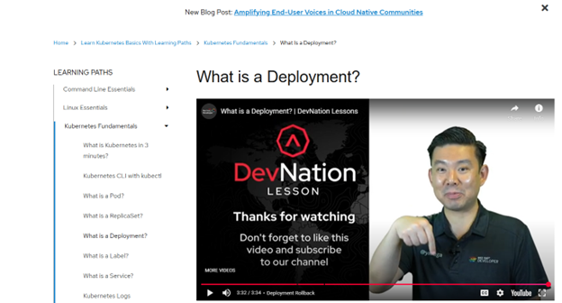
 
 - End of fifth tutorial video
   
### 6. What is a Label?

 - Labels in Kubernetes are key-value pairs attached to objects that enable identifying and organizing resources in meaningful ways. Multiple labels can be applied to a single resource, creating flexible categorization systems for environments, application tiers, or ownership. Admins can update, query, or delete all resources with specific labels in a single operation. Labels are typically defined in YAML files during resource creation but can also be manually applied or modified through kubectl commands. They are intended for identifying and selecting objects based on relevant.
 
 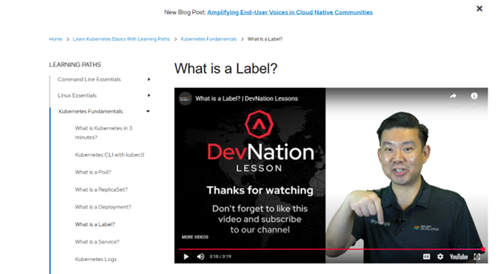
 
 - End of sixth tutorial video
   
### 7. What is a Service?

 - A Service in Kubernetes provides a stable networking endpoint to access one or more instances of an application, abstracting away the underlying Pod infrastructure. It assigns a consistent DNS name and IP address that remains unchanged even as Pods are created, destroyed, or moved between nodes. Services can manage multiple application instances, automatically load balancing traffic between all available Pods that match its selector. Services use label selectors to discover which Pods should receive traffic, automatically updating their endpoints as matching Pods come and go. They provide service discovery capabilities that allow applications to find and communicate with each other without hardcoding IP addresses or hostnames.
 
 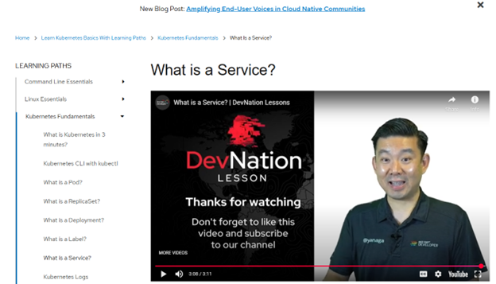
 
 - End of seventh tutorial video
 
### 8. Kubernetes Questions

 1. What is Kubernetes?
 
    - Kubernetes is an open-source container orchestration platform designed to automate the deployment, scaling, and management of containerized applications. It groups containers into logical units for easy management and discovery, providing a framework to run distributed systems resiliently. Kubernetes handles scheduling containers across a cluster of machines, ensuring they run as expected, and manages the lifecycle of containers from creation to termination.
 	
 2. Why would you have a need to use Kubernetes? 
 
    - Kubernetes may be needed to help manage containerized applications at scale. Manual management becomes impractical as container deployments grow beyond a few hosts. Kubernetes becomes essential when you need high availability, automated scaling based on demand, efficient resource utilization across a cluster, simplified deployment processes for complex applications, and consistent management of applications across hybrid or multi-cloud environments. It's particularly valuable for microservices architectures where several containers need to work together reliably.
 	
 3. What are five features that you could leverage from Kubernetes? 
 
    - Kubernetes allows for automated scaling capabilities that dynamically adjust application instances based on resource utilization or custom metrics. The platform's self-healing mechanisms automatically replace failed containers and perform health checks, significantly improving application reliability without manual intervention. Kubernetes simplifies networking through built-in service discovery and load balancing, allowing containers to find and communicate with each other. The orchestration system enables zero-downtime deployments through automated rollouts that carefully introduce changes while monitoring application health, with automatic rollbacks if needed. Lastly, Kubernetes provides secure management of sensitive information and configuration data, allowing teams to handle credentials and application settings separately from container images.
 
---

## Cloud Computing Research

 1. Define the business problem statement for your milestone project.
 
    - Problem: Users need a simple, intuitive, and reliable way to log workouts, view history, and manage fitness goals in one place, with clear feedback and error handling, while ensuring secure authentication and data persistence.
    
    - Statement: Many fitness enthusiasts struggle to consistently track their workouts, monitor progress, and maintain motivation. Existing solutions are often either too complex or too simplistic.
    
 2. Draw a business architecture diagram for your milestone project.
 
    - 
 
 3. Identify the business and technical requirements for your milestone project.
    
    - Business Requirements: 
    
    	- Users must be able to register and log in securely.

		- Users can create, edit, delete, and view workouts.

		- The system must provide error handling and validation (e.g., required fields, duplicate usernames).

		- The app should have a clean and intuitive UI .

		- Users should be able to search and filter workouts.

		- The app must support progress tracking (view history).
		
	- Technical Requirements
	
		- Frontend: Thymeleaf templates with Bootstrap styling.

		- Backend: Spring Boot with MVC architecture.

		- Database: MySQL 8 for persistence.

		- Validation: Jakarta Bean Validation (@NotBlank, @Email, @Min, etc.).

		- Authentication: Spring Security for login/logout.

		- Error Handling: BindingResult + Thymeleaf error messages.

		- Deployment: Runs locally with MAMP/MySQL or on a cloud platform.

		- Scalability: Modular design with fragments for reusable views (navbar, workout form).

 4. Describe three elements that can be defined in a DockerFile. Provide a brief description for each and discuss what the elements are used for. (DQ1) 
 
    - Three Dockerfile elements are RUN, WORKDIR, and CMD. RUN executes commands during the image build process and creates new layers. It supports shell and exec forms, and its results are cached unless intentionally invalidated. WORKDIR sets the working directory for any following instructions and automatically creates the directory if it doesn’t exist. It can be defined multiple times, supports relative paths, and can resolve Dockerfile environment variables. CMD defines the default command or parameters that run when the container starts and only the final CMD instruction is applied. It can be written in shell or exec form and often works alongside ENTRYPOINT to provide default arguments that users can override.
 	
 5. Research the concepts of high availability (HA), failover, and the number of nines. What is HA, failover, and the number of nines? How does the number of nines help solve HA and failover? (DQ2) 
 
    - The concept of High Availability (HA) is the practice of designing systems to remain operational nearly all the time by using redundancy like backup servers, replicated databases, or duplicated services. The intention is that the system can continue functioning even if individual components fail. Failover is the process that switches workloads or traffic from a failing system to a healthy backup, keeping services running with minimal user disruption. This happens in automatically and in conjunction with HA to provide consistent reliability. The “number of nines” expresses uptime targets as percentages, with 4 nines equating to 99.99%, and defines how much downtime is acceptable per year. This helps define HA requirements and failover strategies by setting a reliability goal; the more nines required, the less downtime allowed.
 
--- 

## References

 - Dockerfile reference. (2024). Docker Documentation. https://docs.docker.com/reference/dockerfile
 
 - Four nines and beyond: A guide to high availability infrastructure. (2018, June 21). Work Life by Atlassian. https://www.atlassian.com/blog/statuspage/high-availability
 
 - Kavis, M. J. (2014). Architecting the cloud: Design decisions for cloud computing service models (SaaS, PaaS, and IaaS). Wiley. ISBN-13: 9781118617618
 
 - Play with Docker Classroom. (2019). Play-With-Docker.com. https://training.play-with-docker.com/alacart/
 
 - What is Kubernetes in 3 minutes? | Kube by Example. (2022). Kubebyexample.com. https://kubebyexample.com/learning-paths/kubernetes-fundamentals/what-kubernetes-3-minutes

---

## Conclusion

 - The application was 