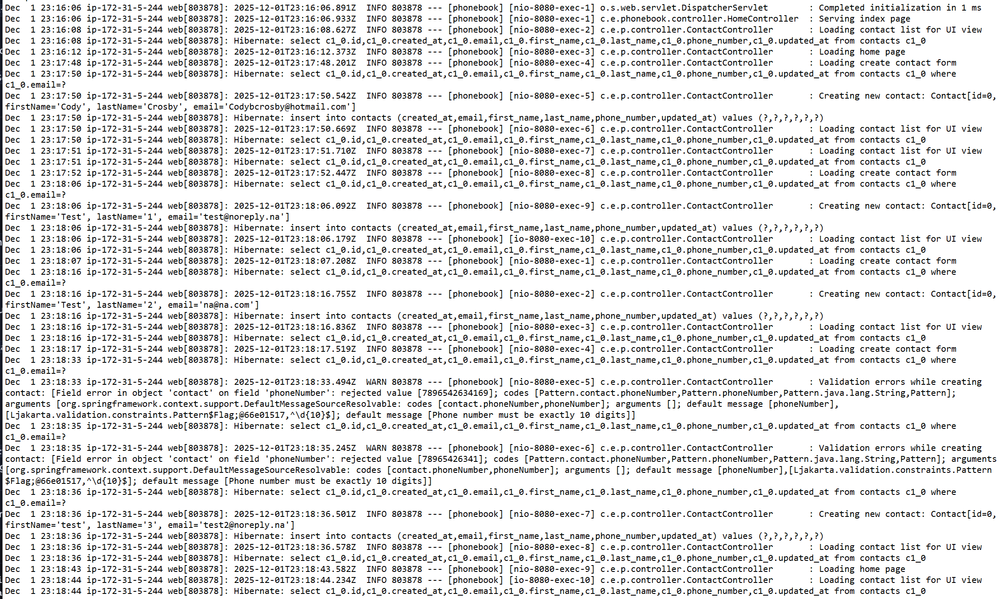
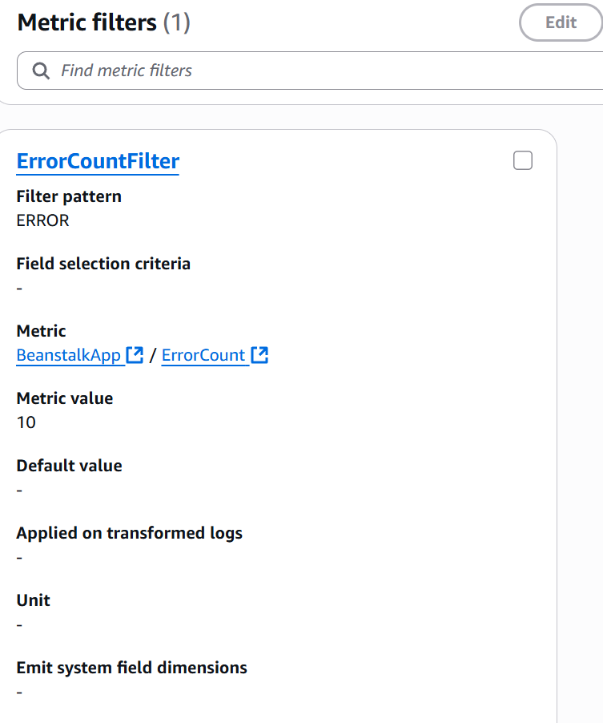
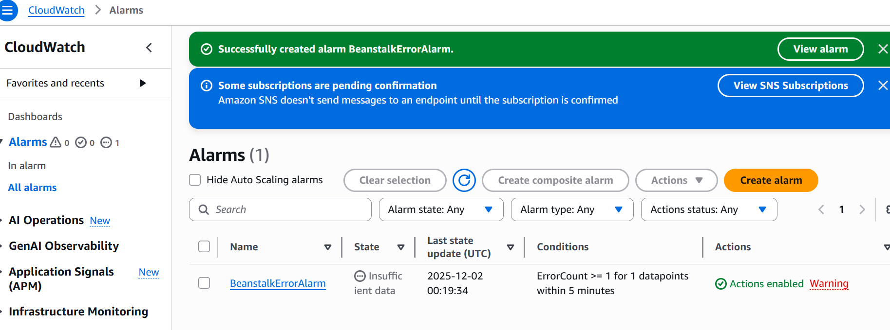
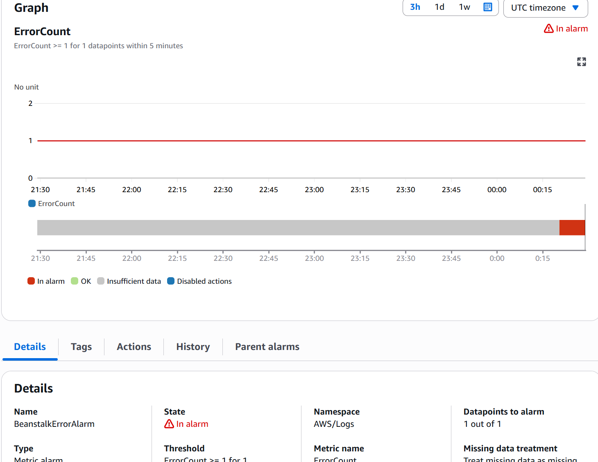
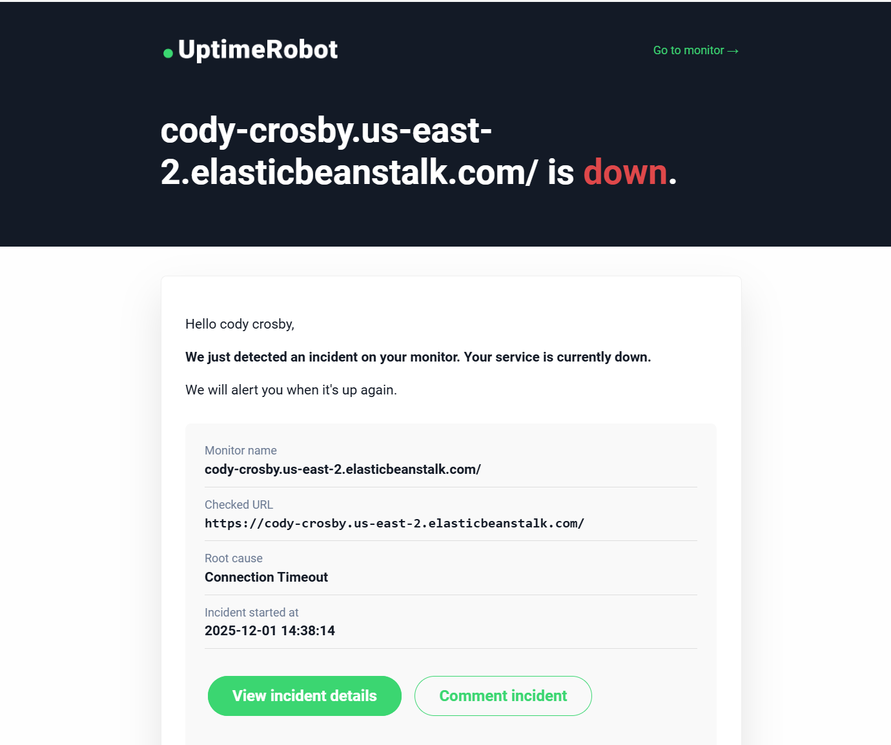

# Activity 6

- Author:  Cody Crosby
- Date:  7 December 2025

---

## Introduction

- This activity  
 
---

## DevOps and Cloud Research

### 1. DevOps Logging Integration

 A. Conducted a full review to ensure all application methods properly implemented logging. Any missing log statements were added, and the updated build was successfully re-deployed to AWS Elastic Beanstalk.

 
 
 - Captured and examined the latest entries from the web.stdout.log file to validate that logging output is functioning as expected
 
 - I was never able to get in touch with the proper Heroku support to create my student account. I deployed to GCP as a secondary 
 
 B. DevOps Logging Questions

 1. Why robust logging is important?
 
    - Robust logging is the primary way in which an application is observed. It provides visibility into how the application behaves under normal and abnormal conditions, which is necessary for diagnosing issues quickly. In distributed cloud environments, where services may be spread across multiple nodes or regions, logs act as the source for understanding what happened and when. Beyond debugging, logs also support auditing and compliance requirements by recording user actions and system events.
 
 2. Three features not implemented but important in production:
 
    1. Log rotation and archival - Log rotation ensures old logs are archived or deleted after a certain size or time threshold. Archival policies also make sure historical logs are preserved for analysis without overwhelming the system.
    
    2. Centralized log aggregation - Centralized aggregation tools like Elasticsearch/Logstash/Kibana allow for the searching, filtering, and visualization of logs across the entire environment. This makes it possible to trace requests end-to-end, correlate events, and detect anomalies that would be otherwise invisible.
    
    3. Structured logging (JSON) - Instead of plain text, structured logs use formats like JSON to make log entries machine-readable. This enables automated parsing, filtering, and analysis by monitoring tools. Structured logging is especially important for microservices where logs are consumed by automated pipelines for alerting, dashboards, and anomaly detection.
 
 3. Two enterprise logging products besides Loggly:
 
    1. Elastic Stack is an open-source suite that provides log ingestion (Logstash), storage and search (Elasticsearch), and visualization (Kibana). It’s highly customizable and widely adopted for centralized logging in cloud-native environments. ELK is known for it's flexibility, scalability, and strong community support.
    
    2. Splunk is a widely used enterprise-grade platform for log management and analysis. It offers powerful search capabilities, dashboards, and machine learning features to detect patterns and anomalies. Splunk is ideal for large organizations that need scalability, compliance features, and advanced analytics.
 
### 2. DevOps Monitoring Integration 

 A. CloudWatch monitoring was enabled for the test application. A metric filter was configured to detect log entries containing the keyword ERROR. Based on this filter, a CloudWatch Alarm was created to trigger whenever one or more errors occur within a five-minute window.

 
 
 - Metric filter created to capture error logs
 
 
 
 - CloudWatch Alarm configured to send notifications to the student’s email address
 
 
 
 - Simulated error successfully detected by the metric filter and alarm
 
 B. An UptimeRobot account was set up to continuously monitor the AWS application and send alerts when downtime is detected.
 
 
 
 - Beanstalk environment temporarily suspended to trigger an uptime alert email
 
 C. DevOps Monitoring Questions:
 
   1. What is the purpose for setting up a log file alert?
    
       - A log file alert helps teams quickly identify critical errors or unusual behavior as soon as they occur. By catching these issues in real time, developers can investigate and resolve problems before they escalate into outages or impact end users.
    
   2. What is the purpose for setting up an application availability alert?
    
        - An availability alert ensures that the application remains accessible and responsive to users at all times. If the app goes down or becomes unreachable, the alert notifies the team immediately so corrective action can be taken. This helps to maintain SLAs and minimize the duration of outages.
 
### 3. DevOps CI/CD Integration

 1. AWS CodePipeline was used since the app is on AWS Beanstalk

 2. [Sceencast](www.google.com) of automated build and deployment to AWS. 

 3. What roles does Maven play when supporting CI/CD?
 
    - Maven manages dependencies, builds artifacts, and standardizes project structure, ensuring consistent builds across environments.
 
 4. What role does a Source Control System play when supporting CI/CD?
  
    - Source control (e.g., Git) tracks code changes, supports collaboration, and triggers pipelines when new commits are pushed.
 
 5. How did your chosen build pipeline tool support CI/CD?
  
    - AWS CodePipeline automated the build, test, and deployment stages, reducing manual effort and ensuring consistency.
 
 6. Besides build and deployment, what are three other features that could be integrated into a build pipeline to support a robust CI/CD?
 
    - Automated testing suites - 
     
    - Security scans - 
     
    - Deployment rollbacks - 
 
---

## Cloud Computing Research

 A. Research the Enterprise Class Logging Analytics and Reporting tool called Splunk (at www.splunk.com). How would this tool be used by DevOps and what features in this tool help DevOps Engineers be proactive rather than reactive to application or infrastructure issues?
 
   - Splunk is an enterprise logging and analytics platform that gives DevOps teams real-time visibility into applications and infrastructure. It collects logs from many sources and makes them searchable, helping engineers quickly trace issues and spot anomalies. Dashboards display KPIs and system health, while alerts notify teams when thresholds are crossed or unusual activity occurs. Splunk also uses machine learning to predict failures and performance problems, allowing teams to act before users are affected. With integrations into CI/CD pipelines and incident response tools, Splunk helps DevOps stay proactive, reduce downtime, and maintain compliance.
    
 B. Read the assigned textbook required readings for this topic. What data information is relevant and should be provided in a log file to support your application in the cloud? Provide three best practices that you should adhere to when adding logging to an application. Provide three issues or risks that could occur if inadequate logging is designed into an application.
  
   - The
 
 C. Research three tools that could support a CI/CD build pipeline. What are the tools and how are they used to support CI/CD?
    
   - Three tools that support CI/CD build pipelines are Azure DevOps, GitLab CI/CD, and Bitbucket Pipelines. Azure DevOps operates as an all-in-one delivery hub, combining planning, repositories, build automation, approvals, and deployment tracking into a single platform. Its tight integration with the Microsoft ecosystem and Azure cloud services makes it particularly effective for organizations already invested in those technologies, while its visibility across the software development lifecycle helps teams catch issues early and limit the impact of bad deployments. GitLab CI/CD utilizes a pipeline-as-code approach, where workflows are defined in YAML and executed by runners, often inside containers. Beyond automation, GitLab differentiates itself with built-in security features such as container scanning, license compliance, and dynamic application security testing, as well as integrations with tools like Terraform and Slack through ChatOps. Bitbucket Pipelines, meanwhile, fits into the Atlassian ecosystem, offering seamless integration with Jira, Confluence, Trello, and Opsgenie. It provides unlimited private repositories, automated builds, pull request scanning, and integrations with security tools like Snyk, enabling organizations to embed DevSecOps practices directly into their workflows.  

 D. From Chapter 14 in the textbook, identify five capabilities that drive the definition of DevOps. What are the five capabilities and how are these used to help improve application development, testing, and delivery? 
 
   - The first capability mentioned in the book is automating infrastructure, which treats infrastructure as code and allows teams to provision environments quickly and consistently. This reduces bottlenecks, eliminates manual errors, and ensures developers, testers, and operations all work with standardized environments. Second is automating deployments, which removes the dependency on manual steps and specific individuals. By scripting deployments, teams can release more frequently, with smaller change sets and lower risk, leading to faster delivery and higher confidence in production changes. Third is designing with feature flags, which enables teams to toggle features on or off without redeploying. This allows safer rollouts, selective testing in production, and rapid rollback of problematic features, all of which improve stability and user experience. Fourth is measurement and monitoring, which provide visibility into system performance and user behavior. By continuously tracking metrics, teams can detect issues early, validate experiments like A/B testing, and make data-driven improvements. Finally, experimenting and failing fast encourages innovation by allowing teams to test new ideas quickly in controlled ways. Combined with automation and monitoring, this capability helps teams adapt and respond to feedback rapidly.
 
--- 

## References

 - GitHub, GitLab, Bitbucket & Azure DevOps: What’s The Difference? (2021). BMC Blogs. https://www.bmc.com/blogs/github-vs-gitlab-vs-bitbucket/
  
 - Kavis, M. J. (2014). Architecting the cloud: Design decisions for cloud computing service models (SaaS, PaaS, and IaaS). Wiley. ISBN-13: 9781118617618

 - Kidd, C. (2024, April 30). What Is Splunk & What Does It Do? An Introduction To Splunk. Splunk-Blogs. https://www.splunk.com/en_us/blog/learn/what-splunk-does.html

---

## Conclusion

 - This activity 