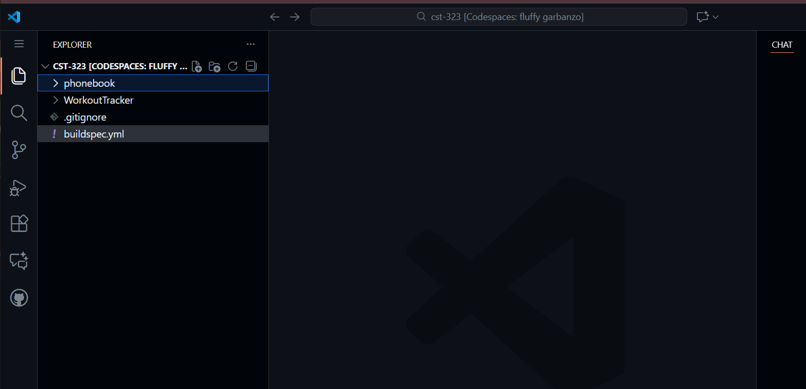
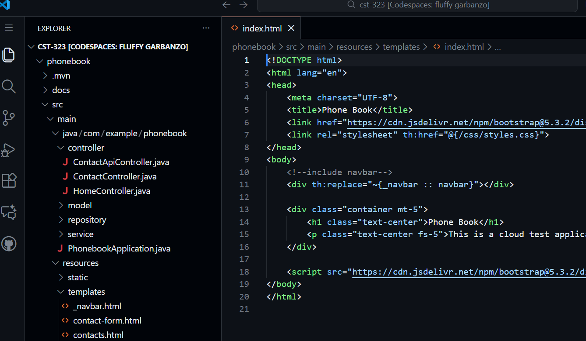
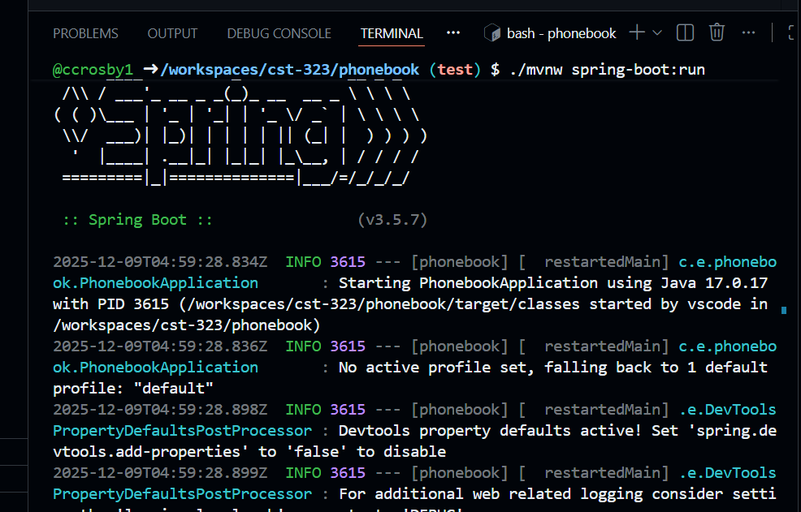
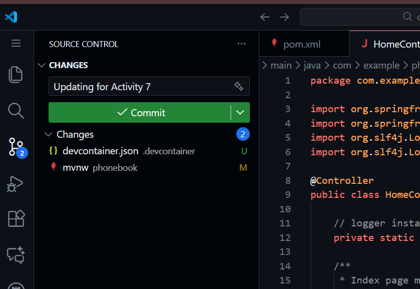

# Activity 7

- Author:  Cody Crosby
- Date:  14 December 2025

---

## Introduction

- This activity will research various cloud-based integrated development environments (IDEs) and explore their features. The test application will be imported into one of these environments to evaluate development workflows. The activity will then evaluate common IDE use cases to assess the overall effectiveness of cloud-based development compared to traditional desktop IDEs.
 
---

## Explore cloud IDE

### Import to GitHub Codespaces
 
 

 - GitHub Codespace created from the CST-323 repository with projects automatically imported
  
 

 - Editing source code directly within the Codespaces environment
  
 

 - Running and testing the application locally inside Codespaces
   
 

 - Integrated version control features available within Codespaces
 
 |Use Case|Supported (Y/N)|Observations on Usability and Productivity|Other Notes|
 |--|--|--|--|
 |Editing Code|Y|Editing files in Codespaces feels identical to desktop VS Code. Syntax highlighting, IntelliSense, and navigation features are all present. The responsiveness is generally good, though it would depend on internet speed.|This feature is robust enough to fully replace a desktop IDE for editing tasks|
 |Running Application Locally|Y|Codespaces allows for running applications inside its containerized environment and preview them in the browser. This makes testing web apps straightforward and convenient. Performance seems adequate for most projects, though heavy workloads may be a bit slower than local.|Codespaces is sufficient for development, but tuning for performance likely still requires local testing|
 |Debugging|Y|The built-in debugger works well and supports the typical breakpoints and step-through debugging. It provides the same experience as desktop VS Code, which makes troubleshooting feel natural.|Debugging in Codespaces is virtually identical to desktop VS Code|
 |Version Control|Y|GitHub integration is seamless in Codespaces. Developers can commit, branch, and open pull requests directly from the IDE. Codespaces also provides the ability to automatically create forks.|Version control is likely stronger than many desktop IDEs because of it's directly integrated with GitHub|
 |Dependency Management|Y|Dependencies can be installed inside the Codespaces container using package managers like npm or Maven, with the process mirroring local development. Installation speed depends on container resources but is generally acceptable.|Dependency management is well supported, though some installs may take longer than on a powerful local machine|
 |Terminal Access|Y|A full terminal is included within the browser, allowing for the running of shell commands and scripts. This makes it easy to manage environments and perform tasks that go beyond the IDE interface.|Termnial access is easily accesssed within Codespaces|
 |IntelliSense|Y|IntelliSense works as expected in Codespaces, providing suggestions, auto-completion, and inline documentation. The experience is nearly identical to desktop VS Code.|IntelliSense support is strong enough to replace desktop IDE functionality|
 |Extension Support|Y|Most VS Code extensions appear to be available in Codespaces, which allows for customization of the environment. Extensions install easily and function as expected. Some extensions that rely on local resources may not work.|There is broad extension support, though specialized tools may need to be verified|
 |Testing Framework|Y|Unit and integration tests can be run inside Codespaces using the terminal or integrated test runners. Results are displayed clearly, and the workflow is similar to desktop IDEs.|Codespaces supports testing well, though container resources may impact performance|
 |Resource Monitoring|N|Codespaces does not provide built‑in resource monitoring tools for CPU or memory usage. This limits visibility into performance issues when running resource-intensive applications.|Resource monitoring is not supported, so performance tuning would not be supported the same as a desktop IDE|
 
### Research Paper
 
>Cloud-based integrated development environments (IDEs) have become increasingly popular as organizations and developers seek flexible, collaborative, and portable solutions for development. GitHub Codespaces, built on Visual Studio Code, offers a browser-based environment with native integration to GitHub repositories (GitHub Docs, 2025). This solution can be compared against common day-to-day IDE use cases to determine if it can reasonably replace a desktop IDE for regular development.
>
>One of the most important use cases is editing code, which Codespaces performs exceptionally well in. The experience mirrors desktop VS Code identically, with syntax highlighting, IntelliSense, and navigational features all present. The responsiveness is generally good, however experience may vary based on connection speed(Ojo, 2021). Similarly, running applications locally is supported through containerized environments, with the ability to preview applications directly in the browser. While performance seems adequate for most projects, resources intensive workloads may run slower than on a local machine (freeCodeCamp, 2021).
>
>Debugging in Codespaces is a virtually identical experience to desktop VS Code. Breakpoints, variable inspection, and step-through debugging are all supported. Version control is an area where Codespaces excels, offering seamless integration with GitHub repositories. Developers can commit, branch, and open pull requests directly from the IDE, arguably providing better version control than many desktop IDEs (Ojo, 2021).
>
>Other common tasks such as dependency management and terminal access are well supported as well. Dependencies can be installed using package managers like npm or Maven, and a full terminal is available within the browser for running shell commands. These closely mirror local development, though installation speed was noted as being slightly slower than desktop. IntelliSense also works as expected, providing auto-completion and inline documentation the same as desktop VS Code. Extension support is broad and allows for customization of the environment with most VS Code extensions (freeCodeCamp, 2021).
>
>The only significant shortcoming noticed was resource monitoring. Codespaces does not provide built-in tools for monitoring system resources like CPU or memory. This limits visibility into performance issues for resource-intensive applications, meaning external tools or local environments may be required for performance tuning (Ojo, 2021).
>
>In conclusion, GitHub Codespaces supports many of the most common IDE use cases effectively, with usability and productivity comparable to desktop IDEs. Its integration with GitHub, competent debugging tools, and strong editing capabilities make it a realistic replacement for day-to-day development. The primary limitation is the lack of resource monitoring, which may affect performance-sensitive projects.

 
---

## Cloud Computing Research

 A. Read the assigned textbook required readings for this topic. Answer the following questions:
 
   1. What is a feature flag or feature toggle?
   
       - A feature flag, or feature toggle, is a technique that allows developers to enable or disable specific functionality in an application without deploying new code. It’s essentially a conditional switch in the codebase that controls whether a feature is visible or active. This makes testing features in production, rolling out changes gradually, or quickly disabling problematic functionality easy to do without requiring a full redeployment.
   
   2. What is A/B testing?
   
       - A/B testing is a method used to compare two versions of a product, feature, or interface to determine which performs better. Users are divided into groups, one that sees version A, and another that sees version B. Metrics such as click-through rates, conversions, or engagement are measured to identify which version provides better results.
   
   3. What is continuous delivery?
   
       - Continuous delivery is a DevOps practice where code changes are automatically built, tested, and prepared for release to production. The key is that the software is always in a deployable state, even if not every change is immediately released. It's intended to reduce risk, shortens release cycles, and allows teams to deliver updates quickly and reliably whenever needed.
   
   4. What is continuous integration?
   
       - Continuous integration is a practice where developers frequently merge their code changes into a shared repository. Each merge triggers automated builds and tests to detect integration issues early. The goal is to ensure that new code works well with the existing codebase, preventing conflicts and reducing bugs.
    
 B. One trend in cloud computing is the ability to develop code in a cloud and browser-based IDE. Research two viable existing cloud and browser-based IDEs on the market. How might these cloud-based IDEs conceptually be used to lower the cost of developing code for a company? What are some disadvantages or features that are missing in the IDEs you researched when comparing them to a desktop-based IDE, such as Eclipse or Visual Studio?
  
   - Two examples of cloud-based IDEs are GitHub Codespaces and Gitpod. GitHub Codespaces provides developers with a VS Code‑based environment that runs in the cloud and is tightly integrated with GitHub repositories (freeCodeCamp, 2021). This integration allows teams to spin up standardized environments, eliminating the need for powerful local machines and reducing the time spent on onboarding or troubleshooting (Ojo, 2021). Gitpod is an open‑source platform that automates the creation of ready‑to‑code environments directly from GitHub, GitLab, or Bitbucket. It helps to reduce the time spent maintaining local setups and so more time can be spent writing code. Both platforms also have limitations compared to traditional desktop IDEs such as Eclipse or Visual Studio. Cloud IDEs require a stable internet connection, meaning offline development is not possible. They can also lag behind desktop IDEs in terms of advanced debugging and customization features, which may be important for some projects. There are other risks and considerations that come with cloud-based products in general. Things like outages or billing managment can directly impact development workflows (freeCodeCamp, 2021).
 
 C. Complete a Scrum retrospective. Document the following:
    
   1. What worked well in this class? 
       
       - One thing that worked well in this class was the structure of the iterative assignment and milestone. Having the weekly activities built on each other, from creating the test app, to hosting it on different cloud providers, and finally implementing DevOps, made the process feel very natural and hands‑on. I found that starting the activities and milestones early in the week helped me manage my busy schedule, and the collaboration with my teammate on the group project was very effective. The class discussions in the DQ forums were also very active, which made it easy to participate throughout the week.
       
   2. What did not work well in this class?
              
       - What did not work as well were some of the instructions for the activities, which seemed outdated and occasionally difficult to follow. This felt especially noticeable with Azure and AWS. In addition, there were occasional technical issues related to account permissions. For example, I was unable to even create an account on Heroku due to restrictions.
       
   3. What would you like to see improved in the design of the class?
                 
       - For improvements in the design of the class, I think an update to the course materials would make a big difference, particularly since cloud providers seem to evolve quickly. Ensuring that guides reflect the latest interface and features would reduce confusion. I think it would also be valuable to expand the scope of the class to include other areas of cloud computing, such as serverless computing. Lastly, it would have been helpful to introduce DevOps a bit earlier in the course, allowing more time to gain hands‑on experience with the automated build and deployment process, particularly for the milestone project.
       
 
--- 

## References

 - freeCodeCamp. (2021, August 30). GitHub Codespaces vs Gitpod – Full Stack Development Moves to the Cloud. FreeCodeCamp.org. https://www.freecodecamp.org/news/github-codespaces-vs-gitpod-cloud-based-dev-environments/
  
 - Kavis, M. J. (2014). Architecting the cloud: Design decisions for cloud computing service models (SaaS, PaaS, and IaaS). Wiley. ISBN-13: 9781118617618
 
 - ‌Ojo, O. (2021, September 2). Github Codespaces vs. Gitpod: Choosing the Best Online Code Editor. Okiki’s Blog. https://blog.okikio.dev/github-codespaces-vs-gitpod-choosing-the-best-online-code-editor

 - Setting up a Java project for GitHub Codespaces - GitHub Docs. (2025). GitHub Docs. https://docs.github.com/en/codespaces/setting-up-your-project-for-codespaces/adding-a-dev-container-configuration/setting-up-your-java-project-for-codespaces

---

## Conclusion

 - This activity explored cloud-based IDEs with a focus on GitHub Codespaces. It included importing a test application, evaluating common IDE use cases such as editing, debugging, version control, and testing, and analyzing the overall effectiveness of cloud-based development compared to traditional desktop IDEs. The findings show that Codespaces can support most day-to-day development tasks with minimal limitations. 